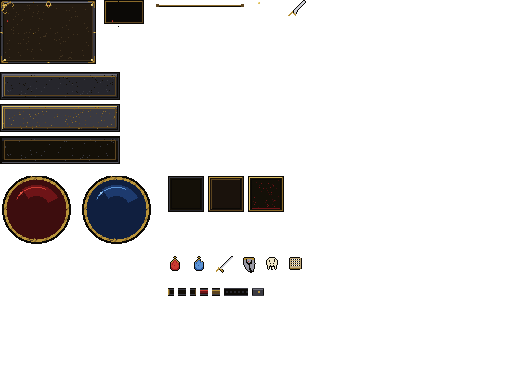

# Спичка


Короткий вертикальный фильм, целиком нарисованный и озвученный в JavaScript.
Ни одной картинки, ни одного звукового файла — в том же духе, что [procedural-film](https://github.com/kuhnhomeuk-cell/procedural-film), только своя история.

Спичка живёт три секунды. Этого хватает, чтобы зажечь другую.

34 секунды, 8 кадров, 96 bpm, 1080×1920. Бумага и тушь, чертёж, удар, пламя, стол, дым. В конце можно зажечь свою: провести головкой по тёрке и донести огонь до свечи.

## Как смотреть

Любой статический сервер из корня репозитория:

```bash
python3 -m http.server 8080
```

Открой `http://localhost:8080`.

Звук включается по нажатию — браузер иначе не отдаёт Web Audio. Пробел ставит на паузу, стрелки перематывают, клавиши 1–8 прыгают по кадрам.

`?t=16.5` открывает фильм с этого момента. `?shot=flame` — середина кадра.

## Шортсы

Отдельные YouTube Shorts, не часть фильма. Вертикальные, 1080×1920, свой чант и свой бит.

| | | |
|---|---|---|
| `shorts1.html` | Цитро доп-доп | `exports/citro-dopdop-ep01.mp4` |
| `shorts2.html` | Сырко вжух-вжух | `exports/syrok-vzhuh-ep01.mp4` |
| `shorts3.html` | Тапок шлёп-шлёп | `exports/tapok-shlep-ep01.mp4` |

Список: `shorts.html`.

## Из чего собрано

| | |
|---|---|
| `index.html` | плеер: рамка, перемотка, список кадров |
| `js/timeline.js` | 8 кадров и таймкод |
| `js/draw.js` | бумага, тушь, спичка, пламя, чертёж |
| `js/scenes.js` | сами кадры |
| `js/audio.js` | партитура: music box, пэд, удар, шорох бумаги |
| `js/main.js` | часы, звук, игра «зажги свою» |

## UI Lab — Dark Fantasy Atlas (итерация 2: Aseprite + aseprite-mcp)



Спрайт-атлас для UI в стиле Diablo II и html-лаборатория с ним в деле.
Атлас целиком собран **Aseprite** (headless-сборка 1.3.18.6 прямо в песочнице,
без UI и Skia) через **MCP-сервер** `@letsagents/aseprite-mcp`: 36 вызовов
инструментов — `create_canvas`, `set_palette`, `add_layer` ×6, `edit_sprite`
×26 (батчи примитивов и пикселей), `script_execute` (slice-метаданные),
`spritesheet_export`. Результат: `atlas.png` 512×384 + `atlas.json`
с 26 регионами и 9-slice центрами + исходник `atlas.aseprite`
(слои: misc · stone · buttons · orbs · slots · icons, палитра 35 цветов).

Открыть: `http://localhost:8080/ui-lab/` (любой статический сервер из корня).

| | |
|---|---|
| сцена | макет игрового экрана: панели и кнопки 9-slice, орбы жизни/маны с процедурной жидкостью, ремень, тултипы, курсор-спрайт |
| анатомия | атлас с slice-рамками и 9-slice центрами, инспектор регионов |
| песочница | слайдеры: растяни 9-slice и убедись, что рамки не плывут |
| конвейер | как MCP-вызовы превращаются в атлас |

Перегенерация: `node tools/gen-atlas.mjs` (`ASEPRITE_PATH=…` — путь к бинарю;
headless-сборка из исходников — `tools/ensure-aseprite-headless.sh`).

## Dark UI (итерация 1: Python-MCP, border-image)

Спрайт-атлас интерфейса в стиле Dark Fantasy (Diablo II) и лаборатория, которая показывает его в деле: стенд 640×480 с инвентарём, глобусами и факелами, CSS-виджеты на `border-image` и инспектор листа. Атлас нарисован кодом и собран через MCP-сервер (`darkui/mcp/server.py`), на выходе — `darkui/atlas/darkui.png`, `darkui.json` и редактируемый `darkui.aseprite`.

```bash
python3 -m http.server 8000   # → http://localhost:8000/darkui/
python3 darkui/mcp/client.py  # пересобрать атлас
```

Подробности: [`darkui/README.md`](darkui/README.md).

