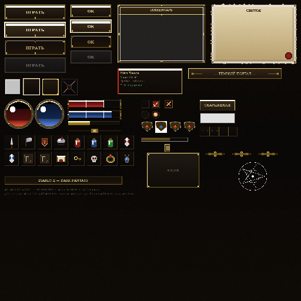

# Diablo II — Dark Fantasy UI Atlas

**Aseprite + MCP → Sprite Atlas → HTML Lab**

Тёмно-фэнтезийный UI-кит в духе **Diablo II**: резной камень, кованое золото, окровавленный пергамент и сферы жизни/маны. Собран процедурно скриптом, эмулирующим **Aseprite MCP**, и оживлён в интерактивной лаборатории.



## Что внутри

**Атлас `1024×1024` — 54 спрайта**

| Категория | Спрайты | Размер | Примечание |
|---|---|---|---|
| Кнопки | `button_large_*` (4), `button_small_*` (4) | 208×52, 140×44 | normal / hover / pressed / disabled |
| Окна | `panel_window`, `panel_parchment` | 300×200, 288×200 | камень + пергамент, 9-slice 24px |
| Слоты | `slot_empty / hover / selected / locked` | 56×56 | инкрустация, крест для locked |
| Сферы | `orb_health`, `orb_mana` | 96×96 | клёпки по кругу, блик |
| Полоски | `bar_health`, `bar_mana`, `bar_xp`, `divider` | 180×28/16/14 | с клёпками на торцах |
| Тултип | `tooltip`, `dialog_bar` | 220×88, 320×38 | легендарный бордер слева |
| Контролы | `checkbox_*`, `radio_*`, `btn_close`, `slider_*`, `tab_*`, `belt` | разное |  |
| Углы | `corner_ornament` ×4 | 40×40 | готический шип + рубин/сапфир |
| Иконки | 16 иконок | 48×48 | меч, топор, щит, шлем, 3 зелья, 2 камня, 2 руны, свиток, ключ, череп, кольцо, амулет |
| Прочее | `header_bar`, `nine_slice_demo` | 400×28, 180×120 | демо 9-slice с линиями разреза |

**Палитра**

- камень `#1a1410` / `#2a2018` / `#3a3020`
- золото `#8a6420` → `#c9a84c` → `#e8d48a`
- кровь `#5a0a0a` → `#7a1a1a` → `#c42a18` → `#ff6a4a`
- пергамент `#d9c8a8` → `#e8dcc0`
- мана `#0a1a3a` → `#2a4a8a` → `#6a9aff`

## Генерация (Aseprite MCP)

Скрипт [`generate_atlas.py`](generate_atlas.py) — эмуляция MCP-вызовов без запуска Aseprite:

```bash
python lab/diablo-ui/generate_atlas.py
# → atlas.png (390 KB) + atlas.json (20 KB) + atlas_thumb.png
```

Что он делает (соответствует MCP):

```python
# mcp.aseprite_create_document(1024,1024)
# mcp.aseprite_create_layer("Stone") -> градиенты камня + шум
# mcp.aseprite_create_layer("Gold")  -> фаски, клёпки, блики
# mcp.aseprite_draw(...) для каждого спрайта
# aseprite --batch --sheet atlas.png --data atlas.json --sheet-type packed
```

Реальный workflow с Aseprite CLI:

```bash
aseprite --cli create 1024x1024 --palette diablo.gpl
# ... MCP рисует слои ...
aseprite --batch atlas.ase --sheet atlas.png --data atlas.json \
  --sheet-type packed --sheet-width 1024 --sheet-height 1024 --inner-padding 0
```

Вывод — `atlas.json` формата TexturePacker/Aseprite:

```json
{
  "frames": {
    "button_large_normal": {"frame": {"x":16,"y":16,"w":208,"h":52}},
    "orb_health": {"frame": {"x":16,"y":340,"w":96,"h":96}}
  },
  "meta": {"app":"Aseprite MCP","image":"atlas.png","size":{"w":1024,"h":1024}}
}
```

## HTML-лаборатория

Открой [`index.html`](index.html) (или `python3 -m http.server` и перейди на `/lab/diablo-ui/`).

**Разделы:**

1. **Атлас-инспектор** — канвас 1:1, сетка 64px, ховер-подсветка, клик копирует `frame`. Список спрайтов справа.
2. **Живой кит:**
   - кнопки (hover/active/disabled)
   - окно инвентаря 6×4 — перетаскивание иконок (drag & drop), клик — выбор, locked-слоты
   - сферы HP/MP — клик и слайдеры, бары и XP-полоска
   - пергамент + диалог Декарда Каина
   - 9-slice — тяни уголок, смотри как тянется центр, углы целы
   - чекбоксы/радио, слайдер, вкладки, пояс
   - 16 иконок — клик добавляет в инвентарь, драг — копирует
3. **MCP — как собрано** — команды, JSON, примеры для Phaser/Pixi/Godot
4. **Скачать** — `atlas.png` + `atlas.json`

### Использование в движке

**Phaser 3**

```js
this.load.atlas('ui','atlas.png','atlas.json');
const btn = this.add.image(x,y,'ui','button_large_normal').setInteractive();
btn.on('pointerover',()=>btn.setFrame('button_large_hover'));
btn.on('pointerdown',()=>btn.setFrame('button_large_pressed'));

// 9-slice
this.add.nineslice(x,y,360,180,'ui','panel_window',24);
```

**PixiJS**

```js
const sheet = await Assets.load('atlas.json');
const spr = new Sprite(sheet.textures['icon_sword']);
```

**Godot**

```
AtlasTexture + NinePatchRect (patch = 24)
```

**CSS**

```css
.icon{width:48px;height:48px;background:url(atlas.png) -16px -460px}
```

## Структура

```
lab/diablo-ui/
  atlas.png              1024×1024
  atlas_thumb.png        512×512
  atlas.json             координаты
  atlas.aseprite.json    мета Aseprite
  generate_atlas.py      генератор (MCP-эмулятор)
  index.html             лаборатория
  README.md
```

## Лицензия

CC0 — делай что хочешь. Упоминание `omgGame lab` приветствуется.

---

*Вдохновлено Diablo II: Lord of Destruction · Шрифты Cinzel / EB Garamond · Собрано в omgGame*

